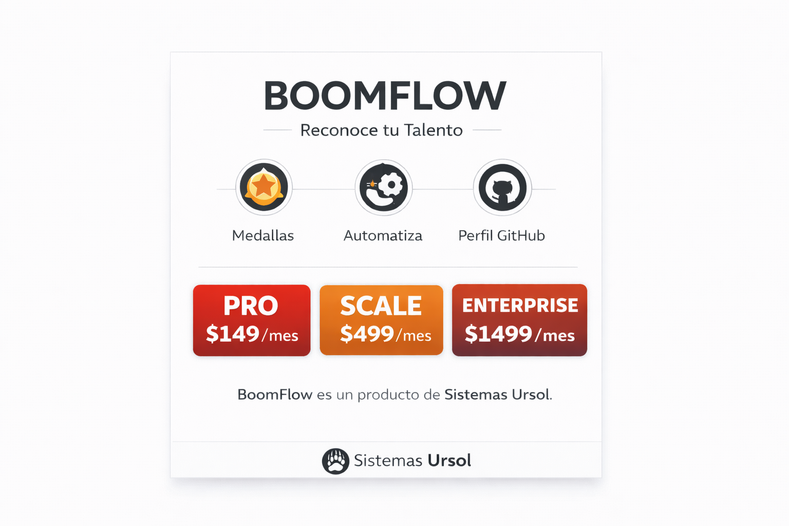

<p align="center">
  
</p>

<h1 align="center">🌸 BOOMFLOW</h1>

<p align="center">
  <strong>Collaborative Performance Infrastructure</strong>
  <br/>
  <em>Where talent isn't managed — it's cultivated.</em>
</p>

<p align="center">
  
  
  
  
  
</p>

---

## 📖 Table of Contents

- [What is BOOMFLOW?](#-what-is-boomflow)
- [Quick Start](#-quick-start)
- [Badge System](#-badge-system)
- [Architecture](#️-architecture)
- [Documentation](#-documentation)
- [Web Dashboard](#-web-dashboard-v30)
- [Administration](#-administration)
- [About Sistemas Ursol](#-about-sistemas-ursol)

---

## 🎯 What is BOOMFLOW?

BOOMFLOW transforms professional recognition into **verifiable assets** displayed on your GitHub profile.

```
┌────────────────────────────────────────────────────────────────────┐
│                                                                    │
│   Your GitHub Activity  ──►  BOOMFLOW analyzes  ──►  🏅 Badges    │
│                                                                    │
│   • Commits                    • Automatically                     │
│   • Pull Requests              • Daily at 6AM UTC                  │
│   • Code Reviews               • No manual intervention            │
│   • Time on team                                                   │
│                                                                    │
└────────────────────────────────────────────────────────────────────┘
```

### Why BOOMFLOW?

| Problem | BOOMFLOW Solution |
|---------|-------------------|
| CVs don't show soft skills | ✅ Verifiable badges for collaboration, mentorship, leadership |
| Recognition gets lost in chat | ✅ Permanent, public history on your GitHub |
| No way to validate achievements | ✅ Every badge has a date, awarder, and full traceability |
| Self-recognition isn't valid | ✅ Only authorized admins can award badges |

---

## 🚀 Quick Start

### For Collaborators (3 steps)

**Step 1:** Request your BOOMFLOW registration from your team lead.

**Step 2:** Add these markers to your GitHub profile `README.md`:

```markdown
<!-- BOOMFLOW-BADGES-START -->
<!-- BOOMFLOW-BADGES-END -->
```

**Step 3:** Badges sync automatically. You're all set!

> 📖 Full guide: [ONBOARDING.md](ONBOARDING.md)

---

## 🏅 Badge System

### 97 Badges Across 11 Categories

| Category | Qty | Description | Examples |
|----------|-----|-------------|---------|
| 🟢 **Onboarding** | 10 | Team integration | Hello World, First Commit |
| 🔵 **Coding** | 21 | Technical excellence | Code Ninja, Bug Slayer |
| 🟣 **DevOps** | 10 | CI/CD and operations | K8s Knight, Deploy Master |
| 🩷 **Collaboration** | 16 | Teamwork | Hackathon Hero, Bridge Builder |
| 🟡 **Leadership** | 10 | Technical leadership | Tech Lead, Architect |
| 📚 **Documentation** | 7 | Shared knowledge | Docs Hero, Wiki Warrior |
| 🌱 **Growth** | 5 | Professional development | Fast Learner, Conference Speaker |
| ❤️ **Milestones** | 9 | Cumulative achievements | Kudo Legend, Streak Master |
| ⭐ **Special** | 1 | Unique recognition | All Star |
| ❤️ **Community** | 4 | Peer-to-peer bonds | Resonance, Team Soul |
| 💎 **Premium** | 4 | Patron investment | Patron Seed, Patron Bloom |

### Tier System

| Tier | Icon | Meaning |
|------|------|---------|
| **Bronze** | 🥉 | Initial achievement reached |
| **Silver** | 🥈 | Demonstrated competence |
| **Gold** | 🥇 | Mastery and excellence |

### Automatic vs. Manual Badges

```
AUTOMATIC (verified via GitHub)              MANUAL (awarded by admins)
───────────────────────────────              ──────────────────────────
✓ first-commit    - 1+ commits              ✓ tech-lead    - Technical leadership
✓ first-pr        - 1+ merged PR            ✓ architect    - System design
✓ code-ninja      - 50+ commits             ✓ mentor       - Guides teammates
✓ week-one        - 7 days on team          ✓ innovator    - Transformative ideas
✓ month-one       - 30 days on team         ✓ crisis-averted - Saved production
✓ year-one        - 365 days on team        ✓ visionary    - Strategic vision
```

> 📖 Full catalog with descriptions: [CATALOG.md](CATALOG.md)

---

## 🏗️ Architecture

```
BOOMFLOW/
├── 📦 Data
│   ├── api-mock.json          # Catalog of 89 badges
│   ├── users/                 # Collaborator data
│   │   ├── jeremy-sud.json
│   │   └── ursolcr.json
│   └── config/
│       └── admins.json        # Authorized administrators
│
├── 🤖 Automation
│   ├── scripts/
│   │   ├── auto-award.js      # Daily metric verification
│   │   ├── process-event.js   # Real-time webhook processor
│   │   ├── badge-admin.js     # Admin CLI
│   │   ├── sync-profile.js    # Syncs badges to profile
│   │   └── stats.js           # Statistics dashboard
│   │
│   └── .github/workflows/
│       ├── auto-award.yml     # Daily cron at 6:00 AM UTC
│       ├── event-processor.yml # Webhooks (PR, review, issue, release)
│       └── badge-protection.yml # Validates permissions on each push
│
├── 🎨 Assets
│   └── assets/                # 89 badge SVGs
│
├── 🔗 GitHub Action
│   └── github-action/         # Action for profile sync
│
└── 🌐 Web Dashboard (Complete MVP)
    └── app-web/               # Next.js 16 + Prisma + NextAuth
        ├── src/app/           # Pages: Dashboard, Profile, Catalog, Feed, Leaderboard
        ├── src/lib/           # Badge Engine, Prisma Client
        ├── src/components/    # UI Components
        └── prisma/            # Schema and Seeds
```

### Data Flow

```
┌─────────────────────────────────────────────────────────────────────────┐
│                           BOOMFLOW FLOW                                 │
├─────────────────────────────────────────────────────────────────────────┤
│                                                                         │
│   TRIGGERS                    PROCESS                    RESULT         │
│   ────────                    ───────                    ──────         │
│                                                                         │
│   ⏰ Cron 6AM UTC ──────►  auto-award.js  ──────►  Automatic badges    │
│                            │ Verifies GitHub                            │
│                            │ API metrics                                │
│                                                                         │
│   🔔 Webhook PR/Review ──► process-event.js ──►  Real-time             │
│                            │ achievement detection                      │
│                                                                         │
│   👤 Admin CLI ──────────► badge-admin.js ────►  Manual badges         │
│                                                                         │
│                                     │                                   │
│                                     ▼                                   │
│                            users/*.json updated                         │
│                                     │                                   │
│                                     ▼                                   │
│                            sync-profile.js ────►  README.md updated    │
│                                                                         │
└─────────────────────────────────────────────────────────────────────────┘
```

> 📖 Detailed architecture: [ARCHITECTURE.md](ARCHITECTURE.md)

---

## 📚 Documentation

| Document | Description | Audience |
|----------|-------------|----------|
| [ONBOARDING.md](ONBOARDING.md) | Guide for new collaborators | 👤 New members |
| [TOKEN_GUIDE.md](TOKEN_GUIDE.md) | Token configuration | 👤 Collaborators |
| [CATALOG.md](CATALOG.md) | 97 badge descriptions | 👤 Everyone |
| [ECONOMY.md](ECONOMY.md) | Social and investment badges | 👤 Everyone |
| [SKINS.md](SKINS.md) | Badge visual customization | 🎨 Everyone |
| [DOCS.md](DOCS.md) | Complete technical reference | 👨‍💻 Developers |
| [ARCHITECTURE.md](ARCHITECTURE.md) | System design | 👨‍💻 Developers |
| [BUSINESS_MODEL.md](BUSINESS_MODEL.md) | B2B SaaS business model | 📊 Stakeholders |

---

## 🌐 Web Dashboard (v3.0)

BOOMFLOW includes a **complete Web Dashboard** with:

### Tech Stack

| Technology | Version | Usage |
|------------|---------|-------|
| Next.js | 16.1.6 | React framework with App Router |
| Prisma | 7.4.0 | ORM and database migrations |
| PostgreSQL | 15+ | Database |
| NextAuth | 5 (beta) | GitHub OAuth authentication |
| Tailwind CSS | 4 | Glassmorphism styling |
| Octokit | Latest | GitHub API integration |

### Pages

| Route | Description |
|-------|-------------|
| `/` | Main dashboard with stats and activity |
| `/profile` | User profile with badges |
| `/catalog` | Full catalog of 97 badges |
| `/feed` | Kudos feed and submission form |
| `/leaderboard` | Rankings by badges/kudos |
| `/login` | GitHub authentication |

### REST APIs

```
GET/POST  /api/kudos              # Feed and create kudos
GET       /api/kudos/user/:user   # User kudos
GET       /api/kudos/categories   # Kudo categories
GET       /api/badges             # Badge catalog
GET       /api/badges/user/:user  # User badges
POST/DEL  /api/badges/award       # Award/revoke badge
GET       /api/badges/progress    # Progress toward badges
POST      /api/badges/evaluate    # Evaluate automatic badges
GET       /api/leaderboard        # Rankings
GET/PATCH /api/notifications      # Notification system
GET/POST  /api/github/sync        # GitHub synchronization
```

### 🔔 Notification System

- **Toast with confetti** when you earn a badge
- **NotificationBell** in sidebar with unread counter
- **Types**: `KUDO_RECEIVED`, `BADGE_EARNED`, `BADGE_PROGRESS`, `MENTION`, `SYSTEM`
- **Auto-refresh** every 30 seconds

### 🔗 GitHub Sync

Automatically syncs your GitHub activity:
- Commits, PRs, Reviews, Issues
- Evaluates badges based on your real activity
- On-demand sync via API

### Badge Engine

Automatic badge awarding system based on triggers:

| Trigger | Description | Example |
|---------|-------------|---------|
| `KUDOS_RECEIVED` | Receive X kudos | Team Spirit (50 kudos) |
| `KUDOS_SENT` | Send X kudos | Feedback Friend (20 kudos) |
| `CODE_REVIEWS` | Complete X reviews | Code Reviewer (100 reviews) |
| `PULL_REQUESTS` | Create X PRs | First PR (1 PR) |
| `STREAK_DAYS` | X active days | 1 Year (365 days) |
| `GITHUB_COMMIT` | GitHub commits | First Commit (1), Code Ninja (50) |
| `GITHUB_PR` | GitHub PRs | First PR (1) |
| `GITHUB_REVIEW` | GitHub reviews | Code Reviewer (10) |

### Dashboard Installation

```bash
cd app-web
npm install

# Configure environment variables
cp env.example .env.local
# Edit: DATABASE_URL, GITHUB_CLIENT_ID, GITHUB_CLIENT_SECRET, AUTH_SECRET

# Initialize database
npm run db:push
npm run db:seed

# Development
npm run dev
```

---

## 🔒 Administration

### Authorized Administrators

Only these users can award badges:

| User | Role | Permissions |
|------|------|-------------|
| [@jeremy-sud](https://github.com/jeremy-sud) | Co-Founder & Dev Lead | All |
| [@ursolcr](https://github.com/ursolcr) | Founder | All |

### Protection System

```
┌──────────────────────────────────────────────────────────────────┐
│                    PROTECTION LAYERS                             │
├──────────────────────────────────────────────────────────────────┤
│                                                                  │
│   1. CODEOWNERS ────────► Requires admin approval               │
│                                                                  │
│   2. badge-protection.yml ► Validates that changes to users/    │
│                             only come from administrators       │
│                                                                  │
│   3. config/admins.json ──► Official administrator list         │
│                                                                  │
│   4. Traceability ────────► Every badge records:                │
│                             • awardedAt: date                   │
│                             • awardedBy: who awarded it         │
│                                                                  │
└──────────────────────────────────────────────────────────────────┘
```

### Administration Commands

```bash
# Award badge
node scripts/badge-admin.js grant <user> <badge-id>

# Revoke badge
node scripts/badge-admin.js revoke <user> <badge-id>

# View statistics
node scripts/stats.js

# Manually sync profile
node scripts/sync-profile.js <user> <readme-path>

# Run auto-award manually
node scripts/auto-award.js
```

---

## 🏢 About Sistemas Ursol

**Sistemas Ursol** believes professional recognition should be:
- ✨ **Verifiable** — Not just words, provable data
- 📈 **Permanent** — Part of your professional portfolio
- 🤝 **Fair** — Awarded by peers, not self-assigned
- 🎯 **Meaningful** — Represents real achievements

### Contact

- 🌐 [www.ursol.com](https://www.ursol.com)
- 💼 [Careers](https://www.ursol.com/careers)

---

## 📋 License

MIT — Public code for transparency and educational reference.

---

## 💼 Plans for Companies

Boomflow offers commercial plans for companies that want to use the platform with their teams — from Pro to Enterprise.
The open-source core is used by Sistemas Ursol and the community, but is not a commercial plan.

<p align="center">
  
</p>

👉 [View available plans](BUSINESS_MODEL.md)

---

<p align="center">
  <strong>🌸 BOOMFLOW</strong><br/>
  <sub>Recognizing talent, one badge at a time.</sub>
</p>
